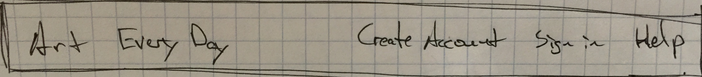
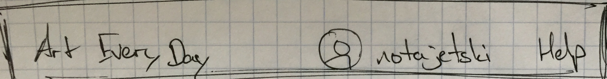
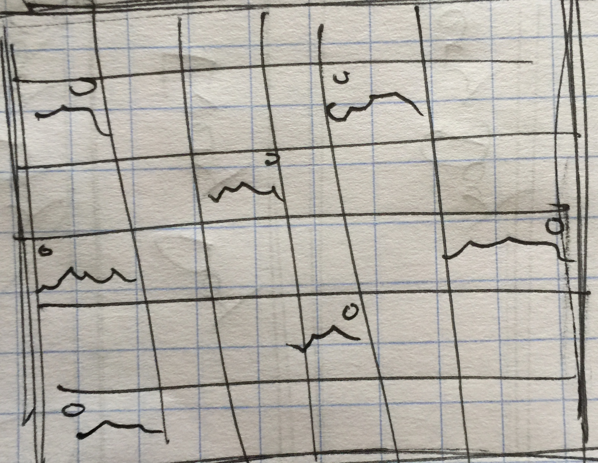

# "Art Every Day" spec

## URLs

| Path                 | Authentication / Authorization states | View / Redirect           |
| -------------------- | ------------------------------------- | ------------------------- |
| `/`                  | unauthenticated                       | Dashboard                 |
| `/`                  | authenticated                         | Dashboard                 |
| `/create-account`    | unauthenticated                       | Create Account            |
| `/create-account`    | authenticated                         | redirect to `/`           |
| `/sign-in`           | unauthenticated                       | Sign In                   |
| `/sign-in`           | authenticated                         | redirect to `/`           |
| `/<date>`            | authenticated or unauthenticated      | Individual Day            |
| `/<username>`        | authenticated or unauthenticated      | Profile                   |
| `/<username>/edit`   | authenticated and authorized          | Profile Edit              |
| `/<username>/edit`   | unauthenticated or unauthorized       | redirect to `/<username>` |
| `/<username>/<date>` | authenticated or unauthenticated      | Individual Art            |

## Views

### Landing Page View

#### URL

`/` (unauthenticated)

#### React Components / Elements

-   [Navbar component](#navbar-component)
-   ["Create Account" / "Sign In" buttons](#create-account--sign-in-buttons)
-   "Today's inspiration" with today's image (links to `/<current-date>`)
-   [Image grid component](#image-grid-component), "individual day" version. (each photo links to `/<username>/<current-date>`)

--------------------------------------------------------------------------------

### Dashboard View

#### URL

`/` (authenticated)

#### Components

-   [Navbar component](#navbar-component)
-   "Today's inspiration" with today's image (links to `/<current-date>`)
-   "Upload your creation" button (links to links to `/<username>/<current-date>`)
-   [Image grid component](#image-grid-component), "individual day" version. (each photo links to `/<username>/<current-date>`)

--------------------------------------------------------------------------------

### Create Account View

#### URL

`/create-account` (unauthenticated)

#### Components

-   [Navbar component](#navbar-component)
-   Email input field (must be validated)
-   Password field (must be at least 8 characters, but I don't care what's in it)
-   Repeat password field (must match) (but we might not need that, with reset password flow)
-   Pick a username field (must be unique in the system - will have to check)
-   "Create account" button (grayed out until all fields are satisfied)

--------------------------------------------------------------------------------

### Sign In View

#### URL

`/sign-in` (unauthenticated)

#### Components

-   [Navbar component](#navbar-component)
-   Email input field (must be validated)
-   Password input field
-   "Sign in" button
-   "Need to create an account" button (links to `/create-account`)
-   "Forgot password?" button (links to `/forgot`)

**TODO: blank, partial, ideal, loading, error states**

--------------------------------------------------------------------------------

### Individual Day View

#### URL

`/<date>` (authenticated and unauthenticated)

#### Components

-   [Navbar component](#navbar-component)
-   "Today's inspiration" with today's image (links to `/<current-date>`) - alternate text depending on if it's "today" or "Jan 1st, 2017"
-   "Upload your creation" button - **only displays if user is authenticated** - (links to `/<username>/<current-date>`)
-   [Image grid component](#image-grid-component), "individual day" version. (each photo links to `/<username>/<current-date>`) - alternate text depending on if it's "today" or "Jan 1st, 2017"

-   "Today's creations" with photo grid (each photo links to `/<username>/<current-date>`) -

**TODO: clean up the button state, and if that should be reused, or if we should just consider it a different view altogether - same thing with today's date**

--------------------------------------------------------------------------------

### Profile View

#### URL

`/<username>` (authenticated and unauthenticated)

#### Components

-   [Navbar component](#navbar-component)
-   User's profile picture
-   Username
-   (if authenticated and authorized) button for "Edit" (links to `/<username>/edit`)
-   (if authenticated and authorized) button for "sign out" (links to `/sign-out`)
-   [Image grid component](#image-grid-component), "individual user" version. (each photo links to `/<username>/<current-date>`)

**TODO: break this into two views, one with edit profile/sign out buttons and one without (authorized and unauthorized)**

--------------------------------------------------------------------------------

### Profile Edit View

#### URL

`/<username>/edit` (authenticated and authorized - otherwise, redirected to `/<username>`)

#### Components

-   [Navbar component](#navbar-component)
-   Username field (verify that it's unique, confirm change)
-   Photo upload/change form input
-   Email input field (need to re-auth) **TODO**
-   Change password input field (need to re-auth) **TODO**
-   Delete my account (includes confirmation - doesn't actually delete the account's data, just sets flag on user)

--------------------------------------------------------------------------------

### Individual Art View

#### App states

Ugh........this one sucks so much

-   authorized user vs unauthorized user
-   uploaded vs not uploaded yet
-   is current date vs is in the past

#### URL

`/<username>/<date>` (authenticated or unauthenticated)

#### Components

-   [Navbar component](#navbar-component)
-   User image component (links to image asset)
-   Inspiration image component (links to `/<date>`)
-   User "card" component (links to `/<username>`)
-   Countdown indicating how much time a user has left to upload some art
-   Upload button for the user to upload an image

--------------------------------------------------------------------------------

## Components

### Navbar Component

The little navbar that sits at the top of the page on every view

#### App states

**Unauthenticated**

App name, "create account" button, "sign in" button, and link to support

**Authenticated**

App name, user profile image, authenticated user's username, and link to support

#### Elements / Subcomponents

-   App name (Art Every Day)
-   Create Account button (links to `/create-account`)
-   Sign in button (links to `/sign-in`)
-   Username of authenticated user (links to `/<username>`)
-   Profile image thumbnail of authenticated user (links to `/<username>`)
-   "help" support link (links to `/support`)

--------------------------------------------------------------------------------

### Image Grid Component

#### App states

**Individual Day**

Displays all of the images that have been uploaded for a single day

**Individual User**

Displays all of the images that a single user has uploaded. If the user didn't upload an image for a certain day, just make that day transparent (but clickable).

#### Elements / Subcomponents

-   Flexbox grid, centered, responsive
-   Each photo links to `/<username>/<date>`

**TODO: UI states, (blank, loading, partial, error, ideal)**

--------------------------------------------------------------------------------

# "Create Account" / "Sign In" buttons

--------------------------------------------------------------------------------

## Closing thoughts
